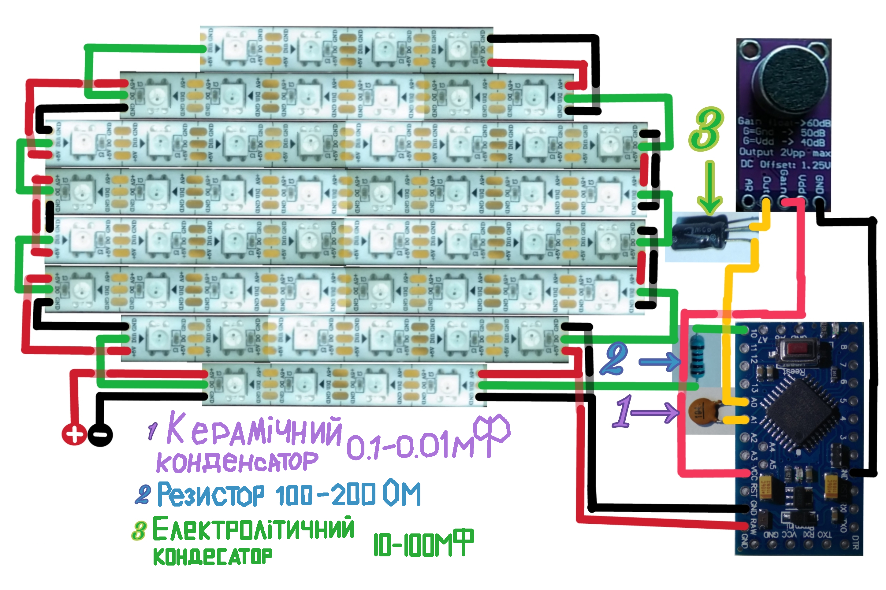
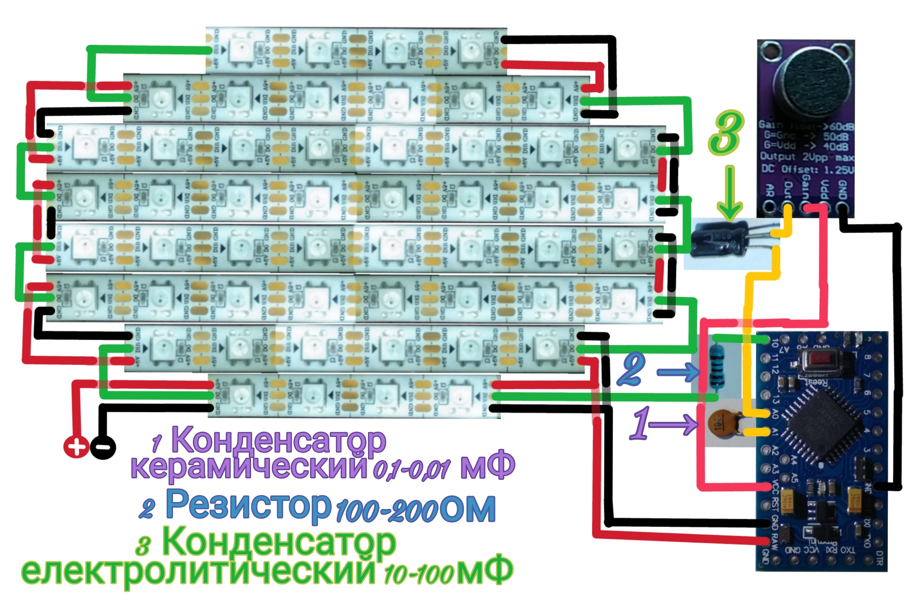

# Медична маска з говорячими світлодіодами

## Матеріали

* Світлодіодна лента [WS2812B 1m 60 IP65](https://www.aliexpress.com/item/2036819167.html)
* [Arduino Pro Mini 3.3v](https://www.aliexpress.com/item/32966475348.html)
* Мікрофон [MAX9814](https://www.aliexpress.com/item/32660519341.html)
* Перехідник [USB-UART, наприклад CP2102](https://www.aliexpress.com/item/32480350871.html)
* Резистор 100-200 Ом
* Електролітичений конденсатор 10-100 мФ
* Керамічний конденсатор 0.01-0.1 мФ
* Li-Ion аккумулятор 3.7v

## Схема маски

## Відео
[Відео російською на YouTube](https://www.youtube.com/watch?v=H2TMpz6suMY)

# Медицинская маска с говорящими светодиодами

## Материалы

* Светодиодная лента [WS2812B 1m 60 IP65](https://aliexpress.ru/item/2036819167.html)
* [Arduino Pro Mini 3.3v](https://aliexpress.ru/item/32966475348.html)
* Микрофон [MAX9814](https://aliexpress.ru/item/32660519341.html)
* Переходник [USB-UART, например CP2102](https://aliexpress.ru/item/32480350871.html)
* Резистор 100-200 Ом
* Электролитический конденсатор 10-100 мФ
* Керамический конденсатор 0.01-0.1 мФ
* Li-Ion аккумулятор 3.7v

## Схема маски

## Видео
[Видео на YouTube](https://www.youtube.com/watch?v=H2TMpz6suMY)
